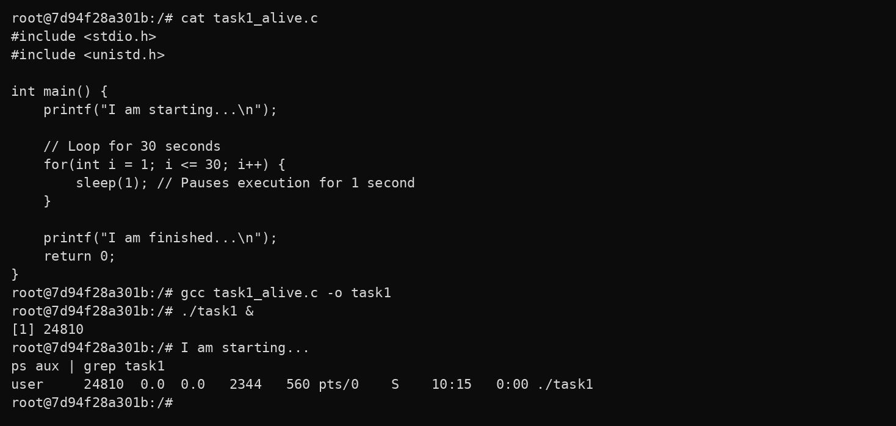
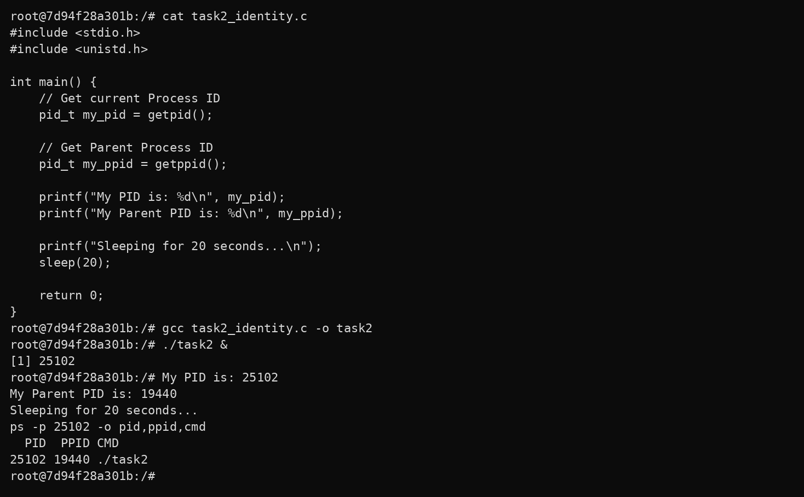
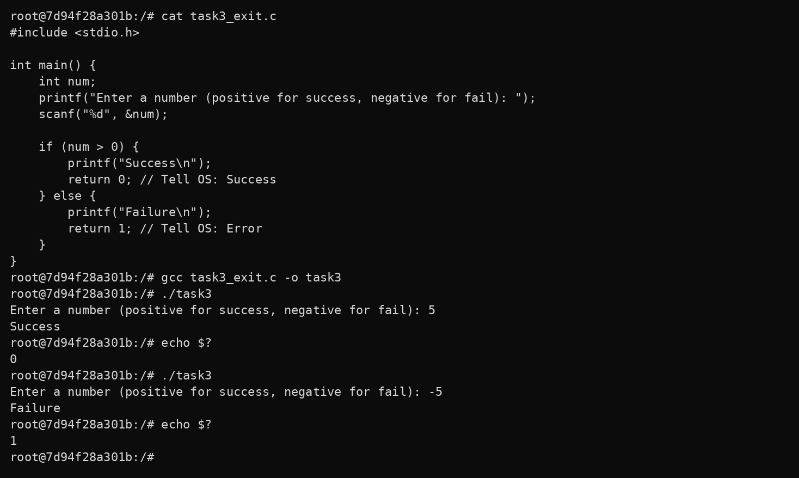
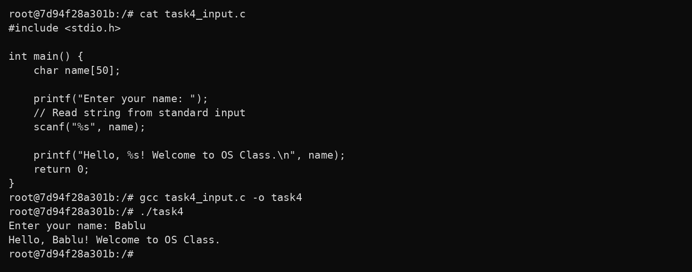
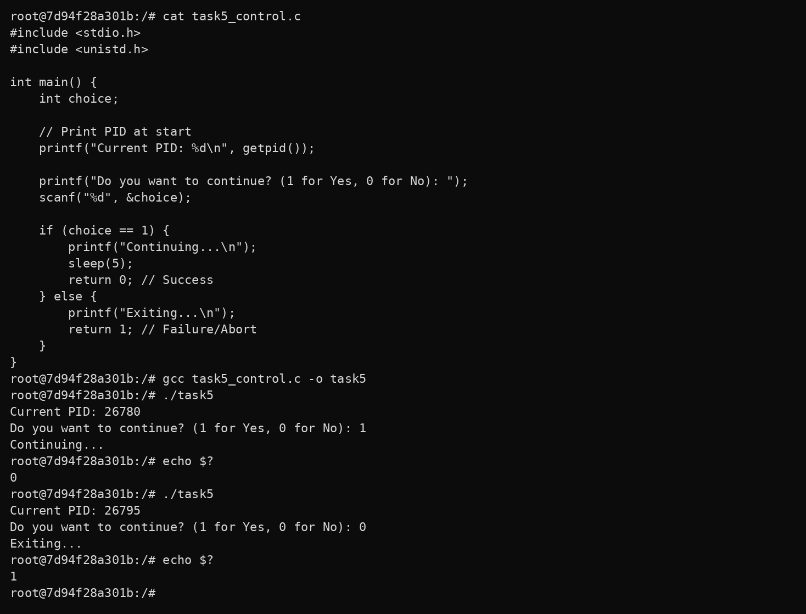

# Lab 3: Investigating Process Lifecycles and OS Interaction
## Comprehensive Step-by-Step Technical Documentation

---

## I. Executive Introduction

In **Lecture 3 & Lecture 2**, we learned that an Operating System manages processes and system resources. In this laboratory, we bring that theory to life. Instead of just writing code that prints text, we author C programs that interact directly with the Linux kernel to query process identity, control execution lifecycles, and communicate success or failure back to the host shell.

---

## II. Lecture 2 Architecture: A Process Layout & OS Loading

### 1. Program vs. Process
* **File / Executable**: A static binary stored on disk, consisting of machine instructions and ELF metadata. It remains inactive until executed.
* **Process**: A dynamic program in active execution loaded into main memory (RAM). The OS allocates virtual memory, registers, and tracks it via a unique PID.

### 2. Memory Process Layout
When a process is loaded into RAM, the Linux kernel organizes its virtual address space into five distinct segments:

1. **Stack Segment**: Stores function parameters, local variables, and return pointers (grows downwards).
2. **Heap Segment**: Manages dynamic memory allocated via `malloc()` / `free()` (grows upwards).
3. **BSS Segment (`.bss`)**: Uninitialized global and static variables; zeroed out by the kernel.
4. **Data Segment (`.data`)**: Initialized global and static variables loaded directly from the binary.
5. **Code / Text Segment (`.text`)**: Executable CPU machine instructions; marked Read-Only/Executable (`R-X`).

### 3. How the OS Loads and Executes a Program
1. **User Invocation**: The user types `./program` in the terminal shell.
2. **`fork()` System Call**: The shell creates a child process copy of itself.
3. **`execve()` System Call**: The child process replaces its address space with the target binary.
4. **OS Kernel Actions**: The kernel validates the ELF header, maps memory segments, sets up `argc`, `argv`, `envp` on the stack, and transfers execution to `_start`.
5. **Runtime Initiation**: `_start` invokes `__libc_start_main()`, which initializes runtime libraries and calls `main()`.
6. **Termination & Cleanup**: Upon exit, the OS frees all memory pages, closes open file descriptors, updates the process table, and returns the exit status code to the shell (`$?`).

---

## III. Step-by-Step Practical Lab Tasks

### Task 1: The Long-Running Process
* **Objective**: In enterprise servers, processes run for days or months. We must know how to run a process in the background using `&` and monitor it while it is active using `ps aux`.
* **Command**: `cat task1_alive.c then gcc task1_alive.c -o task1 then ./task1 & then ps aux | grep task1`
* **Terminal Screenshot**:

* **Observation**: The `&` operator launches `./task1` in the background with job ID `[1]` and PID `24810`. The `ps aux` command shows the process running in status `S` (**Interruptible Sleep**), confirming that `sleep(1)` yields CPU cycles while waiting for the timer to elapse.

---

### Task 2: Process Identity (PID and PPID)
* **Objective**: Every process in Linux has a unique Process ID (`PID`). The process that created it is the Parent Process ID (`PPID`), usually your terminal shell. Query these using `getpid()` and `getppid()`, and verify them via `ps -p <PID> -o pid,ppid,cmd`.
* **Command**: `cat task2_identity.c then gcc task2_identity.c -o task2 then ./task2 & then ps -p 25102 -o pid,ppid,cmd`
* **Terminal Screenshot**:

* **Observation**: The program reports its own `PID: 25102` and parent `PPID: 19440`. The OS command `ps -p 25102 -o pid,ppid,cmd` corroborates this directly from the kernel task list, proving that PPID `19440` corresponds to the calling bash terminal shell.

---

### Task 3: Exit Codes and OS Feedback ($?)
* **Objective**: When a program finishes, it returns an integer to the OS. `0` means "Success", and any non-zero number (like `1`) means "Error/Failure". The shell stores this in `$?`.
* **Command**: `cat task3_exit.c then gcc task3_exit.c -o task3 then ./task3 then echo $?`
* **Terminal Screenshot**:

* **Observation**: A positive number (`5`) causes the program to return `0` (**Success**), verified via `echo $?`. A negative number (`-5`) causes the program to return `1` (**Failure**), verified via `echo $?`. This exit code mechanism allows shell scripts and pipelines to determine whether subsequent commands should proceed.

---

### Task 4: Standard I/O Streams
* **Objective**: The OS provides standard input (`stdin`, fd 0) and standard output (`stdout`, fd 1) streams. `scanf()` reads from `stdin`, and `printf()` writes to `stdout`.
* **Command**: `cat task4_input.c then gcc task4_input.c -o task4 then ./task4`
* **Terminal Screenshot**:

* **Observation**: The OS kernel automatically inherits file descriptors upon process initialization. `scanf()` reads user input from `stdin` ("Bablu"), and `printf()` formats and emits data to `stdout` ("Hello, Bablu! Welcome to OS Class.").

---

### Task 5: Conditional Execution and Termination
* **Objective**: Programs often branch based on user input. The OS tracks the final exit code to determine if the script or automation pipeline should continue or halt.
* **Command**: `cat task5_control.c then gcc task5_control.c -o task5 then ./task5 then echo $?`
* **Terminal Screenshot**:

* **Observation**: Choosing `1` continues execution, sleeps for 5 seconds, and returns `0` (`Success`). Choosing `0` aborts execution and returns `1` (`Failure`). Each invocation receives a distinct PID (`26780` vs `26795`), illustrating the full lifecycle of process creation and destruction.

---

## IV. Lecture 2 Knowledge Test Q&A Reference

1. **What is the difference between source code and an executable?**
   * *Answer*: Source code is human-readable high-level code (`.c`). An executable is a machine-readable binary file (`.out` / ELF) containing CPU instructions and data sections created by the compiler.
2. **What command compiles a C program?**
   * *Answer*: `gcc <source_file.c> -o <output_binary>`
3. **What is the role of an Operating System during program execution?**
   * *Answer*: The OS allocates memory (segments), loads code into RAM, assigns a process control block (PCB) and unique PID, schedules CPU time, and mediates access to hardware.
4. **What does the command `./myprogram` do?**
   * *Answer*: Tells the shell to fork a new process, execute the binary located at `./myprogram` via `execve`, and attach stdin/stdout/stderr to the current terminal.
5. **Why does an OS provide feedback after execution?**
   * *Answer*: Through exit status codes (0 for success, non-zero for failure), enabling shell scripts and pipelines to make programmatic control flow decisions.
6. **What is a process layout in memory?**
   * *Answer*: The organized structural mapping of virtual address space allocated to an active process, consisting of Text, Data, BSS, Heap, and Stack segments.
7. **Name the different sections of memory allocated to a process.**
   * *Answer*: Stack, Heap, BSS (Block Started by Symbol), Data Segment, and Code/Text Segment.
8. **What is stored in the Code/Text section?**
   * *Answer*: The compiled machine instructions of the program, marked read-only to prevent self-modifying code vulnerabilities.
9. **What is stored in the Data section?**
   * *Answer*: Initialized global and static variables that have predetermined values before program execution starts.
10. **What is stored in the BSS section?**
    * *Answer*: Uninitialized global and static variables. The OS zero-initializes this entire block during loading without consuming space in the binary file.
11. **What is the difference between the Stack and the Heap?**
    * *Answer*: The Stack stores automatic local variables and function call frames (fast, LIFO, fixed size, grows downward). The Heap is dynamically managed memory allocated at runtime via `malloc()`/`calloc()` (flexible, manually freed, grows upward).
12. **Which direction does the Stack grow in memory?**
    * *Answer*: Downwards (from higher virtual memory addresses to lower memory addresses).
13. **Which direction does the Heap grow in memory?**
    * *Answer*: Upwards (from lower virtual memory addresses to higher memory addresses toward the stack).
14. **What happens when the Stack and Heap collide?**
    * *Answer*: Out-of-memory error resulting in a segmentation fault (`SIGSEGV`) or stack overflow crash. Modern OSes place a guard page between them.
15. **Why are memory sections separated in a process layout?**
    * *Answer*: For memory protection, security (W^X / DEP - Data Execution Prevention), modularity, and virtual memory paging efficiency.
